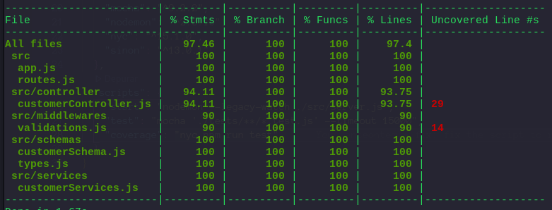

# API de elegibilidade de clientes!

### Projeto de uma API em Node.js utilizando tecnologias como Docker e com testes!

---

## Visão Geral

##### Este é um projeto que propunha uma aplicação que pudesse dizer, através de um input, se o perfil do possível cliente é elegível ou não para firmar parceria.

##### Bibliotecas:

- [Express](https://expressjs.com/) v^4.17.3 - Framework Node
- [Nodemon](https://www.npmjs.com/package/nodemon) v^2.0.15 - Reinicia automaticamente o servidor quando detecta alterações
- [JOI](https://joi.dev/) v^17.6.0 - Validações dos campos
- [Chai](https://www.chaijs.com/) v^4.3.6 - Asserções dos testes
- [Eslint](https://eslint.org/) v^8.11.0 - Padronização e formatação do projeto
- [Mocha](https://joi.dev/) v^9.2.2 - Estruturação e runtime de testes
- [Sinon](https://sinonjs.org/) v^17.6.0 - Mocks, spiões e stubs para testes
- [nyc/Istanbul](https://github.com/istanbuljs/nyc) v^13.0.1 - Cobertura de testes

## **Sumário**

- [Pré Requisitos](#pré-requisitos)
- [Instalação](#instalação)
- [Contexto e Regras de Negócio](#contexto-e-regras-de-negócio)
- [Rotas | Endpoints](#rotas-|-endpoints)
- [Testes](#testes)
- [Sobre o autor](#sobre-o-autor)

---

## **Pré requisitos**

##### Este projeto foi feito utilizando Docker e docker-compose, portanto, caso queira utilizar esse projeto, é necessário já ter feito a instalação.

Esse projeto foi feito utilizando Docker e docker-compose, mas caso não deseje instalar nada ou baixar o projeto em sua máquina, é possível fazê-lo pois foi disponibilizada uma versão online da aplicação. Tanto as formas de utilização LOCAL quanto ONLINE serão instruídas na seção abaixo.

---

## **Instalação**

### Utilização local

1. Para utilizar localmente é necessário ter o Docker instalado em sua máquina. Mais instruções para instalação podem ser encontradas nos links a seguir:  [Docker](https://docs.docker.com/get-docker/). e [Docker-compose](https://docs.docker.com/compose/install/)

2. Com o Docker e Compose instalados, você pode baixar o projeto em sua máquina utilizando o comando:

   **`git clone git@github.com:CaioMorato/desafio-lemon.git`**

3. Entre na pasta do projeto digitando o comando **`cd desafio-lemon`**

3. Instale as dependências do projeto digitando **`npm install`** em seu terminal, ou **`yarn`** caso prefira o gerenciador yarn

4.  Inicie o container do docker utilizando o comando **`docker-compose -p NOME_PARA_O_CONTAINER up`**

   1. Repare que a flag -p com o **NOME_PARA_O_CONTAINER** é opcional, é só uma maneira de você dar o nome para um container e uma imagem. Também vale destacar que quando você der o nome, eles possuirão um sufixo **_app**. Caso não seja passado essa flag com um nome desejado, o nome padrão tanto da **imagem** quanto do **conteiner** serão "**desafio-lemon_app**"

5. O servidor está iniciado na porta 3000 e você pode começar a fazer as requisições com os formatos descritos na seção de **ROTAS**


### **Utilização online**

1. Foi disponibilizado uma api online onde poderá ser feito requisições de forma a não instalar nada no computador. É só fazer as requisições com os formatos descritots na seção de **ROTAS**. O link para acessar a API está logo abaixo.
   1. **https://desafio-lemon-api.herokuapp.com/**
   1. [ATENÇÃO] - Vale destacar que a **primeira requisição** do Heroku pode demorar e as vezes até falhar. Se não funcionar de primeira, por gentileza **tente cancelar e refazer** a requisição.


### [\*BONUS\*] - **Utilização com interface gráfica**

Em caráter de bônus, produzi um **website** para que se possa utilizar a aplicação através de uma interface gráfica a fim de aumentar a experiência do usuário, mas, além disso, mostrar que me preocupo além de tudo com todas as fases do processo que meu código passa até chegar ao cliente final.

O website pode ser acessado através deste link: **https://desafio-lemon-front.vercel.app/**

Vale lembrar que aplicam-se as mesmas regras de negócio da API que podem ser verificadas abaixo.

---

## Contexto e Regras de Negócio

### O contexto dessa API é gerar uma resposta se o perfil do cliente é elegível ou não para a empresa, através de um input de usuário.


### Critérios de Elegibilidade:

Para se tornar elegível o cliente deve seguir alguns critérios:

- **Classe de consumo**: Comercial, Residencial ou Industrial
- **Modalidade tarifária**: Convencional ou Branca
- **Consumo mínimo do cliente**:
  - Clientes com uma conexão **Monofásica** devem ter o consumo médio **acima de 400kWh**
  - Clientes com uma conexão **Bifásica** devem ter o consumo médio acima de **500kWh**
  - Clientes com uma conexão **Trifásica** devem ter o consumo médio acima de **750kWh**


Após o envio do perfil do usuário, a API retornará uma resposta dizendo se o cliente é elegível ou não. 

**Caso o cliente seja elegível**, a API também retorna no mesmo corpo da requisição dizendo qual a economia anual de CO2 com base no consumo energético do cliente.

Caso o cliente **NÃO** seja elegível, a API retorna no mesmo corpo da requisição dizendo quais são os critérios que motivaram a não-elegibilidade!

### Abaixo encontram-se as rotas possíveis para se efetuar as requisições junto com exemplos.

---

## Rotas | Endpoints

## Verificar funcionamento da API

- #### GET- `/`

Através desse endpoint, é possível verificar se a API está em funcionamento diretamente pelo browser, caso o projeto seja baixado localmente.

Ao fazer a requisição para a rota especificada, o programa retornará a seguinte resposta:

```json
{
	"status": 200,
	"message": "API funcionando!"
}
```


## Verificar elegibilidade

- #### **POST** - `/customer`

  Através desse endpoint, é possível verificar se o perfil do cliente atinge os critérios de elegibilidade.

  É necessário enviar uma requisição com o formato JSON no corpo, com o seguinte formato:

  ```json
  {
    "numeroDoDocumento": "14041737706",
    "tipoDeConexao": "bifasico",
    "classeDeConsumo": "comercial",
    "modalidadeTarifaria": "convencional",
    "historicoDeConsumo": [
      3878, 
      9760, 
      5976, 
      2797, 
      2481, 
      5731, 
      7538, 
      4392, 
      7859, 
      4160, 
      6941, 
      4597  
    ]
  }
  
  ```

  A resposta se dará no seguinte exemplo caso atinja os critérios de elegibilidade:

  

  **Elegível**:

  ```json
  {
     "elegivel": true,
     "economiaAnualDeCO2": 462.77,
  }
  ```

  

  **Não elegível**

  ```json
  {
    "elegível": false,
  	"razoesInelegibilidade": [
      "Classe de consumo não atendida",
      "Modalidade tarifária não aceita"
    ]
  }
  ```

  

  ### **Validações:**

- O campo **"numeroDoDocumento"** deve ter o formato String com a quantidade de caracteres entre 11 e 14.
  
- O campo **"tipoDeConexao"** deve ter o formato String e aceita um dos seguintes valores: ["monofásico", "bifásico", "trifásico"]
  
- O campo **"classeDeConsumo"** deve ter o formato String e aceita um dos seguintes valores: ["comercial", "residencial", "industrial", "poder público" e "rural"]

- O campo **"modalidadeTarifaria"** deve ter o formato String e aceita um dos seguintes valores: ['branca', "azul", "verde", "convencional"]

- O campo **"historicoDeConsumo"** deve ser um Array com números inteiros dentro. 

  - Os números dentro do Array devem ser números inteiros de 0 a 9999.
  - Também é necessário colocar no mínimo 3 números e no máximo 12 dentro do Array.


---

## Testes

#### Esse projeto conta com uma cobertura de testes unitários.

Foram utilizadas as bibliotecas **mocha**,**chai** e **sinon** para efetuar os testes e também a biblioteca **nyc/istanbul** para verificar a cobertura de testes

#### Os testes podem ser realizados digitando o seguinte comando em seu terminal:

- **npm:**

**`npm test`**

- **yarn:**

**`yarn test`**

##### E a cobertura dos testes pode ser verificada digitando o seguinte comando:

- **npm:**

**`npm run coverage`**

- **yarn:**

**`yarn run coverage`**

##### Gerando a seguinte resposta, que mostra que o projeto conta uma cobertura de 97% de testes unitários:



---

## **Sobre o autor**

Olá! Que bom que chegou até aqui!

Eu me chamo Caio, e sou estudante de desenvolvimento Web. Comecei meus estudos no ano de 2021, e estou me apaixonando cada dia que passa, através dos estudos, por tecnologia e desenvolvimento. Esse projeto e esse README foram desenvolvidos como um desafio técnico. Eu empenhei muito carinho na construção de cada linha.

[Você pode olhar mais dos meus repositórios aqui](https://github.com/CaioMorato)

[Ou se conectar comigo no linkedin!](https://www.linkedin.com/in/morato-dev/)
